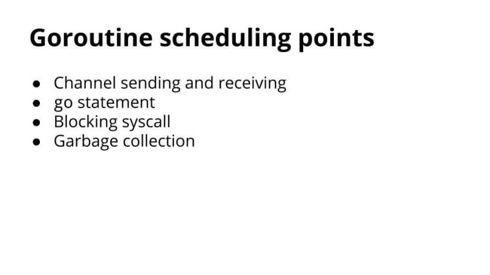

## Goroutine - TIL

Các kiến thức đã học được về goroutine

### Goroutine introduction

<https://go.dev/tour/concurrency/1>

A goroutine is a lightweight thread managed by the Go runtime.

```go
go f(x, y, z)
```
starts a new goroutine running

```go
f(x, y, z)
```
The evaluation of `f, x, y, and z` happens in the current goroutine and the execution of f happens in the new goroutine.

Goroutines run in the same address space, so access to shared memory must be synchronized. The sync package provides useful primitives, although you won't need them much in Go as there are other primitives. (See the next slide.)

### Channels

Channels are a typed conduit through which you can send and receive values with the channel operator, <-.

```go
ch <- v    // Send v to channel ch.
v := <-ch  // Receive from ch, and
           // assign value to v.
```

(The data flows in the direction of the arrow.)
Like maps and slices, channels must be created before use:

```go
ch := make(chan int)
```
By default, **sends and receives block until the other side is ready**. This allows goroutines to synchronize without explicit locks or condition variables.

The example code sums the numbers in a slice, distributing the work between two goroutines. Once both goroutines have completed their computation, it calculates the final result.

<https://dev.to/gophers/what-are-goroutines-and-how-are-they-scheduled-2nj3>

Goroutines are cheap to create and very easy to use. Any function in go can be run concurrently by simply appending the go keyword to the function call.

**So goroutines are threads?**

To people new to Go, the word goroutine and thread get used a little interchangeably. This makes sense if you come from a language such as Java where you can quite literally make new OS threads. Go is different, and a goroutine is not the same as a thread. Threads are much more expensive to create, use more memory and switching between threads takes longer.

Goroutines are an abstraction over threads and a single Operating System thread can run many goroutines.

**So How are goroutines scheduled?**

- <https://www.youtube.com/watch?v=YHRO5WQGh0k>
- <https://dev.to/girishg4t/internals-of-goroutines-and-channels-397p>

Internals of Go Scheduling

Arguably, one of the more important aspects of the Go run-time is the goroutine scheduler. The runtime keeps track of each goroutine, and will schedule them to run in turn on a pool of thr eads belonging to the process. Goroutines are separate from threads but rely upon them to run, and scheduling goroutines onto threads effectively is crucial for the efficient performance of Go programs. The idea behind goroutines is that they are capable of running concurrently,like threads, but are also extremely lightweight in comparison. So, while there might be multiple threads created for a process running a Go program, the ratio of goroutines to threads should be much higher than 1-to-1. Multiple threads are often necessary to ensure that goroutines are not unnecessarily blocked. When one goroutine makes a blocking call,the thread running it must block. Therefore, at least one more thread should be created by the runtime to continue the execution of other goroutines that are not in blocking calls. Multiple threads are allowed to run in parallel upto a programmer defined maximum, which is stored in the variable GOMAXPROCS[6].

THE SCHED STRUCT

The Sched struct is a single, global struct[9] that keeps track of the different queues of G’s and M’s and some other information the scheduler needs in order to run, such as the global Sched lock. There are two queues containing G structs, one is the runnable queue where M’s can find work, and the other is a free list of G’s. There is only one queue pertaining to M’s that the scheduler maintains; the M’s in this queue are idle and waiting for work. In order to modify these queues,the global Sched lock must be held. See figure 4.

The runtime starts out with several G’s. One is in charge of garbage collection, another is in charge of scheduling, and one represents the user’s Go code. Initially, one M is created to kick off the runtime. As the program progresses,more G’s may be created by the user’s Go program, and more M’s may become necessary to run all the G’s. As this happens, the runtime may provision additional threads upto GOMAXPROCS. Hence at any given time, there are at most GOMAXPROCS active M’s.

Since M’s represent threads, an M is required to run a goroutine. An M without a currently associated G will pick up a G from the global runnable queue and run the Go code belonging to that G. If the Go code requires the M to block,for instance by invoking a system call, then another M will be woken up from the global queue of idle M’s. This is done to ensure that goroutines, still capable of running, are not blocked from running by the lack of an available M.

System calls force the calling thread to trap to the kernel,causing it to block for the duration of the system call execution. If the code associated with a G makes a blocking system call, the M running it will be unable to run it or any other G until the system call returns. M’s do not exhibit the same blocking behavior for channel communication, even though goroutines block on channel communication. The operating system does not know about channel communication, and the intricacies of channels are handled purely by the runtime. If a goroutine makes a channel call, it may need to block, but there is no reason that the M running that G should be forced to block as well. In a case such as this, the G’s status is set to waiting and the M that was previously running it continues running other G’s until the channel communication is complete. At that point the G’s status is set back to runnable and will be run as soon as there is an M capable of running it.

**When does a goroutine exit?**

Firstly, we always have a main goroutine. This is the programs main "thread" (see, it's hard to avoid this word when discussing them!). When this main goroutine terminates, our program is complete. You always need to keep this in mind as if we do not account for this in our program, you may see some unexpected behaviour. If you look at the example of using goroutines above again, the program will not wait for either of the goroutines to complete before terminating the program. This is why we have to use a time.Sleep() but this means our program has a race condition.

From this main goroutine, we can create as many goroutines as we like, and within those goroutines, we can create goroutines. The below is totally valid go:


**Are goroutines called in the order I declared them?**

No.

Most Operating Systems have something called a preemptive scheduler. This means that which thread is executed next is determined by the OS itself based on thread priority and other things like waiting to receive data over the network. Since goroutines are abstractions over threads, they all have the same priority and we therefore cannot control the order in which they run.

There has been discussions as far back as 2016 (you can read one such discussion here) about adding the ability to set priority on individual goroutines, but there is some pretty compelling points raised as to why its not a good idea.

**How Goroutines works**

Goroutines take the idea of threads a step further.

Goroutines are cooperatively scheduled, rather than relying on the kernel to manage their time sharing.

The switch between goroutines only happens at well defined points, when an explicit call is made to the Go runtime scheduler.

The compiler knows the registers which are in /use and saves them automatically.




### Goroutine example: HTTPTimeoutHandler in Go Built-in HTTP Server Package

- <https://ieftimov.com/posts/make-resilient-golang-net-http-servers-using-timeouts-deadlines-context-cancellation/>
- <https://cs.opensource.google/go/go/+/master:src/net/http/server.go;l=3620>
- <https://ieftimov.com/posts/make-resilient-golang-net-http-servers-using-timeouts-deadlines-context-cancellation/>

```go

// TimeoutHandler returns a [Handler] that runs h with the given time limit.
//
// The new Handler calls h.ServeHTTP to handle each request, but if a
// call runs for longer than its time limit, the handler responds with
// a 503 Service Unavailable error and the given message in its body.
// (If msg is empty, a suitable default message will be sent.)
// After such a timeout, writes by h to its [ResponseWriter] will return
// [ErrHandlerTimeout].
//
// TimeoutHandler supports the [Pusher] interface but does not support
// the [Hijacker] or [Flusher] interfaces.
func TimeoutHandler(h Handler, dt time.Duration, msg string) Handler {
	return &timeoutHandler{
		handler: h,
		body:    msg,
		dt:      dt,
	}
}

// ErrHandlerTimeout is returned on [ResponseWriter] Write calls
// in handlers which have timed out.
var ErrHandlerTimeout = errors.New("http: Handler timeout")

type timeoutHandler struct {
	handler Handler
	body    string
	dt      time.Duration

	// When set, no context will be created and this context will
	// be used instead.
	testContext context.Context
}

func (h *timeoutHandler) errorBody() string {
	if h.body != "" {
		return h.body
	}
	return "<html><head><title>Timeout</title></head><body><h1>Timeout</h1></body></html>"
}

func (h *timeoutHandler) ServeHTTP(w ResponseWriter, r *Request) {
	ctx := h.testContext
	if ctx == nil {
		var cancelCtx context.CancelFunc
		ctx, cancelCtx = context.WithTimeout(r.Context(), h.dt)
		defer cancelCtx()
	}
	r = r.WithContext(ctx)
	done := make(chan struct{})
	tw := &timeoutWriter{
		w:   w,
		h:   make(Header),
		req: r,
	}
	panicChan := make(chan any, 1)
	go func() {
		defer func() {
			if p := recover(); p != nil {
				panicChan <- p
			}
		}()
		h.handler.ServeHTTP(tw, r)
		close(done)
	}()
	select {
	case p := <-panicChan:
		panic(p)
	case <-done:
		tw.mu.Lock()
		defer tw.mu.Unlock()
		dst := w.Header()
		for k, vv := range tw.h {
			dst[k] = vv
		}
		if !tw.wroteHeader {
			tw.code = StatusOK
		}
		w.WriteHeader(tw.code)
		w.Write(tw.wbuf.Bytes())
	case <-ctx.Done():
		tw.mu.Lock()
		defer tw.mu.Unlock()
		switch err := ctx.Err(); err {
		case context.DeadlineExceeded:
			w.WriteHeader(StatusServiceUnavailable)
			io.WriteString(w, h.errorBody())
			tw.err = ErrHandlerTimeout
		default:
			w.WriteHeader(StatusServiceUnavailable)
			tw.err = err
		}
	}
}
```

Usage this handler

```go
package main

import (
	"fmt"
	"io"
	"net/http"
	"time"
)

func slowHandler(w http.ResponseWriter, req *http.Request) {
	time.Sleep(2 * time.Second)
	io.WriteString(w, "I am slow!\n")
}

func main() {
	srv := http.Server{
		Addr:         ":8888",
		WriteTimeout: 5 * time.Second,
		Handler:      http.TimeoutHandler(http.HandlerFunc(slowHandler), 1*time.Second, "Timeout!\n"),
	}

	if err := srv.ListenAndServe(); err != nil {
		fmt.Printf("Server failed: %s\n", err)
	}
}
```

<https://groups.google.com/g/golang-nuts/c/kvP6VlWtZlg>


### How to cancel a running goroutine when using with TimeoutHandler

<https://stackoverflow.com/questions/60737889/http-timeouthandler-returns-but-handlerfunc-keeps-running>

> When the timeout happens and your handler function still runs (haven't returned), the request's context will be cancelled. Your handler is responsible to monitor the Context's Done channel, and abort its work if cancel is requested. Each handler runs in its own goroutine, and goroutines cannot be killed or interrupted from the "outside"

<https://groups.google.com/g/golang-nuts/c/kvP6VlWtZlg>

Your inner request handler needs to use the request context to cancel its work.

```go
package main

import (
	"log"
	"net/http"
	"time"
)

type foo struct{}

func (f foo) ServeHTTP(w http.ResponseWriter, r *http.Request) {
	log.Print("New request")
	for i := 0; i < 10; i++ {
		select {
		case <-r.Context().Done():
			log.Print("Aborted")
			return
		case <-time.After(1 * time.Second):
			log.Print("Tick")
		}
		w.Write([]byte(".\n"))
	}
	w.Write([]byte("hello world\n"))
	log.Print("Completed")
}

func main() {
	fooHandler := foo{}
	timeoutHandler := http.TimeoutHandler(fooHandler, 5*time.Second, "Too slow!\n")
	http.Handle("/foo", timeoutHandler)
	log.Fatal(http.ListenAndServe(":8080", nil))
}

```

To test:

`curl localhost:8080/foo`

### Fire and forget goroutines

<https://stackoverflow.com/questions/68359637/fire-and-forget-goroutine-golang>

**Opinion 1:**

I would recommend always having your goroutines under control to avoid memory and system exhaustion. If you are receiving a spike of requests and you start spawning goroutines without control, probably the system will go down soon or later.

In those cases where you need to return an immediate 200Ok the best approach is to create a message queue, so the server only needs to create a job in the queue and return the ok and forget. The rest will be handled by a consumer asynchronously.

Producer (HTTP server) >>> Queue >>> Consumer

Normally, the queue is an external resource (RabbitMQ, AWS SQS...) but for teaching purposes, you can achieve the same effect using a channel as a message queue.

In the example you'll see how we create a channel to communicate 2 processes. Then we start the worker process that will read from the channel and later the server with a handler that will write to the channel.

**Opinion 2:**

There is no "goroutine cleaning" you have to handle, you just launch goroutines and they'll be cleaned when the function launched as a goroutine returns. Quoting from Spec: Go statements

> When the function terminates, its goroutine also terminates. If the function has any return values, they are discarded when the function completes.

<https://go.dev/ref/spec#Go_statements>

A "go" statement starts the execution of a function call as an independent concurrent thread of control, or goroutine, within the same address space.

The expression must be a function or method call; it cannot be parenthesized. Calls of built-in functions are restricted as for expression statements.

The function value and parameters are evaluated as usual in the calling goroutine, but unlike with a regular call, program execution does not wait for the invoked function to complete. Instead, the function begins executing independently in a new goroutine. When the function terminates, its goroutine also terminates. If the function has any return values, they are discarded when the function completes.

### Go routines leaks problems

- <https://brainbaking.com/post/2024/03/the-case-of-a-leaky-goroutine/>
- <https://www.uber.com/en-BE/blog/leakprof-featherlight-in-production-goroutine-leak-detection/>

Programmatic errors (e.g., complex control flow, early returns, timeouts), can lead to mismatch in communication between goroutines, where one or more goroutines may block but no other goroutine will ever create the necessary conditions for unblocking. Goroutine leaks prevent the  garbage collector from reclaiming the associated channel, goroutine stack, and all reachable objects of the permanently blocked goroutine. Long-running services where small leaks accumulate over time exacerbate the problem. 

Go distribution does not offer any out-of-the-box solution for detecting goroutine leaks, whether during compilation or at runtime. Detecting goroutine leaks is non-trivial as they may depend on complex interactions/interleavings between several goroutines, or otherwise rare runtime conditions. Several proposed static analysis techniques [1, 2, 3] are prone to imprecision, both reporting false positives or incurring false negatives. Other proposals such as goleak employ dynamic analysis during testing, which may reveal several blocking errors, but their efficacy depends on the comprehensive coverage of code paths and thread schedules. Exhaustive coverage is infeasible at a large scale; for example, certain configuration flags changing code paths in production are not necessarily tested by unit-tests. 

<https://www.ardanlabs.com/blog/2018/11/goroutine-leaks-the-forgotten-sender.html>

Concurrent programming allows developers to solve problems using more than one path of execution and is often used in an attempt to improve performance. Concurrency doesn’t mean these multiple paths are executing in parallel; it means these paths are executing out-of-order instead of sequentially. Historically, this type of programming is facilitated using libraries that are either provided by a standard library or from 3rd party developers.

Concurrent programming allows developers to solve problems using more than one path of execution and is often used in an attempt to improve performance. Concurrency doesn’t mean these multiple paths are executing in parallel; it means these paths are executing out-of-order instead of sequentially. Historically, this type of programming is facilitated using libraries that are either provided by a standard library or from 3rd party developers.

**Leaking Goroutines**

When it comes to memory management, Go deals with many of the details for you. The Go compiler decides where values are located in memory using escape analysis. The runtime tracks and manages heap allocations through the use of the garbage collector. Though it’s not impossible to create memory leaks in your applications, the chances are greatly reduced.

A common type of memory leak is leaking Goroutines. If you start a Goroutine that you expect to eventually terminate but it never does then it has leaked. It lives for the lifetime of the application and any memory allocated for the Goroutine can’t be released. This is part of the reasoning behind the advice **Never start a goroutine without knowing how it will stop**.

**Never start a goroutine without knowing how it will stop**

<https://dave.cheney.net/2016/12/22/never-start-a-goroutine-without-knowing-how-it-will-stop>

In Go, goroutines are cheap to create and efficient to schedule. The Go runtime has been written for programs with tens of thousands of goroutines as the norm, hundreds of thousands are not unexpected. But goroutines do have a finite cost in terms of memory footprint; you cannot create an infinite number of them.

Every time you use the go keyword in your program to launch a goroutine, you must know how, and when, that goroutine will exit. If you don’t know the answer, that’s a potential memory leak.

Consider this trivial code snippet:

```go
ch := somefunction()
go func() {
        for range ch { }
}()
```

This code obtains a channel of int from somefunction and starts a goroutine to drain it. When will this goroutine exit? It will only exit when ch is closed. When will that occur? It’s hard to say, ch is returned by somefunction. So, depending on the state of somefunction, ch might never be closed, causing the goroutine to quietly leak.

In your design, **some goroutines may run until the program exits**, for example a background goroutine watching a configuration file, or the main conn. Accept loop in your server. **However, these goroutines are rare enough I don’t consider them an exception to this rule.**

Every time you write the statement go in a program, you should consider the question of how, and under what conditions, the goroutine you are about to start, **will end**.

### References

- <TBA>